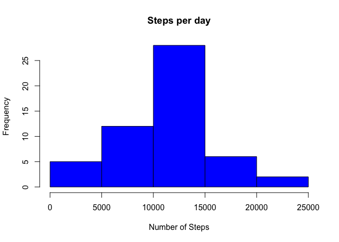
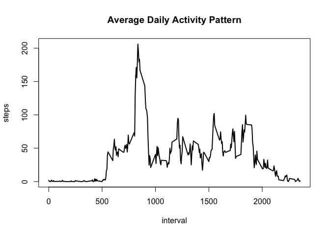
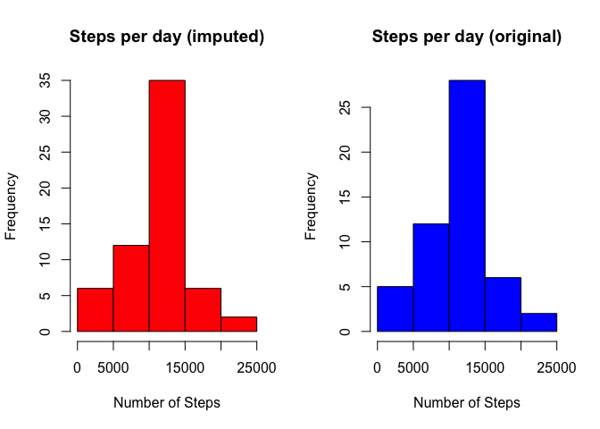
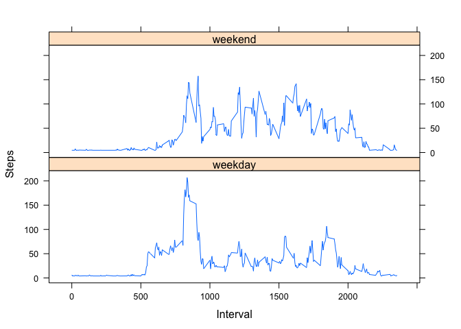

# Reproducible Research: Peer Assessment 1


## Loading and preprocessing the data
Loading and examining the data

```r
activity <- read.csv("activity.csv")
str(activity)
```

```
## 'data.frame':	17568 obs. of  3 variables:
##  $ steps   : int  NA NA NA NA NA NA NA NA NA NA ...
##  $ date    : Factor w/ 61 levels "2012-10-01","2012-10-02",..: 1 1 1 1 1 1 1 1 1 1 ...
##  $ interval: int  0 5 10 15 20 25 30 35 40 45 ...
```
Changing the date column to date format in R and summing data into days

```r
activity$date <- as.Date(activity$date)
byday <- aggregate(steps ~ date, activity, sum)
str(byday)
```

```
## 'data.frame':	53 obs. of  2 variables:
##  $ date : Date, format: "2012-10-02" "2012-10-03" ...
##  $ steps: int  126 11352 12116 13294 15420 11015 12811 9900 10304 17382 ...
```
Making a histogram of the total number of steps per day

```r
hist(byday$steps, xlab = "Number of Steps", main = "Steps per day", col = "blue")
```

 

## What is mean total number of steps taken per day?
Calculating the mean by day

```r
stepmean <- round(mean(byday$steps, na.rm=TRUE))
```
Calculating the median

```r
stepmedian <- median(byday$steps, na.rm=TRUE)
```
<li> the mean is ``1.0766\times 10^{4}``
<li> the median is ``10765``

## What is the average daily activity pattern?

```r
byinterval <- aggregate(steps ~ interval, activity, mean)
plot(byinterval$interval, byinterval$steps, type="l", lwd=2, xlab="interval", ylab="steps", main="Average Daily Activity Pattern")
```

 

```r
intmax <- which.max(byinterval$steps)
intmax <- byinterval[intmax,1]
```
<li> The 5-minute interval with the maximum number of steps is ``835``

## Imputing missing values
Calculating total NAs

```r
sum(is.na(activity[,1]))
```

```
## [1] 2304
```

Starting by inputting 0 in for NA's on 2012-10-01

```r
NAvect1 <- which(is.na(activity[,1])==TRUE & activity[,2]=="2012-10-01")
imputed <- activity
imputed[NAvect1,1] <- 0
```

Using Impute function from the Hmisc package

```r
library(Hmisc)
```

```
## Loading required package: grid
## Loading required package: lattice
## Loading required package: survival
## Loading required package: Formula
## Loading required package: ggplot2
## 
## Attaching package: 'Hmisc'
## 
## The following objects are masked from 'package:base':
## 
##     format.pval, round.POSIXt, trunc.POSIXt, units
```

```r
imputed$steps <- impute(imputed$steps, fun=mean)
```

Finally, lets check to make sure we got rid of those NA's

```r
summary(imputed)
```

```
## 
##  2016 values imputed to 36.69033
```

```
##      steps             date               interval     
##  Min.   :  0.00   Min.   :2012-10-01   Min.   :   0.0  
##  1st Qu.:  0.00   1st Qu.:2012-10-16   1st Qu.: 588.8  
##  Median :  0.00   Median :2012-10-31   Median :1177.5  
##  Mean   : 36.69   Mean   :2012-10-31   Mean   :1177.5  
##  3rd Qu.: 36.69   3rd Qu.:2012-11-15   3rd Qu.:1766.2  
##  Max.   :806.00   Max.   :2012-11-30   Max.   :2355.0
```

Now lets analyze and compare our imputed data

```r
imputedbyday <- aggregate(steps ~ date, imputed, sum)
par(mfrow = c(1,2))
hist(imputedbyday$steps, xlab = "Number of Steps", main = "Steps per day (imputed)", col = "red")
hist(byday$steps, xlab = "Number of Steps", main = "Steps per day (original)", col = "blue")
```

 

```r
impstepmean <- round(mean(imputedbyday$steps))
impstepmedian <- median(imputedbyday$steps)
```
<li>Original mean =``1.0766\times 10^{4}`` Imputed mean=``1.0567\times 10^{4}``
<li>Original median = ``10765`` Imputed median=``1.0566815\times 10^{4}``

## Are there differences in activity patterns between weekdays and weekends?

looping through data to create weekday/weekend factor

```r
imputed$weekday <- as.character(rep(NA))
imputed$date <- as.POSIXct(imputed$date)
imputed$weekday <- weekdays(imputed$date)
for (i in 1:nrow(imputed)){
    if (imputed[i,4]=="Monday" | imputed[i,4]=="Tuesday" | imputed[i,4]=="Wednesday" | imputed[i,4]=="Thursday" | imputed[i,4]=="Friday"){
    imputed[i,4] <- "weekday"
    } else {
    imputed[i,4] <- "weekend"
    }
}
imputed$weekday <- as.factor(imputed$weekday)
```
Aggregating interval means by daytype

```r
imputedmeans <- aggregate(steps ~ interval + weekday, data = imputed, mean)
```
Making our plot

```r
library(lattice)
xyplot(steps ~ interval | weekday, imputedmeans, type = "l", lwd = 1, xlab="Interval", ylab="Steps", layout = c(1,2))
```

 

